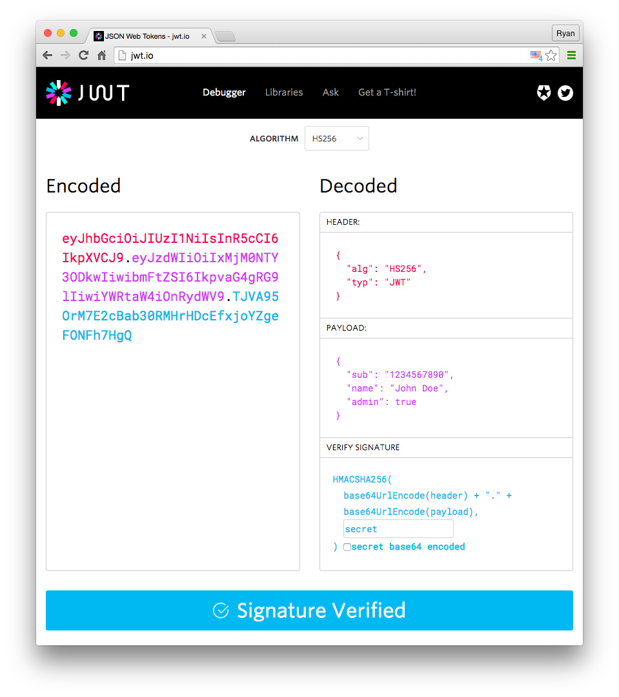

# How to use JWT - JSON Web Token

__JSON Web Token (JWT) is an open standard (RFC 7519) that defines a compact and self-contained way for securely transmitting information between parties as a JSON object.__

[JWT.IO](https://jwt.io/) allows anyone to decode, verify and generate JWT easily.

## How does JWT work?

<div style="text-align:center"></div>

 A JWT is made of 3 parts: the Header, the Payload and the Signature.

 - __Header__: The header typically consists of two parts: the type of the token, which is JWT, and the signing algorithm being used, such as HMAC SHA256 or RSA.

 For example: 

 ```
 {
  "alg": "HS256",
  "typ": "JWT"
}
 ``` 

 Then, this JSON is Base64Url encoded to form the first part of the JWT.

 - __Payload__: The second part of the token is the payload, which contains the claims. Claims are statements about an entity (typically, the user) and additional data. 

 An example payload could be:

 ```
 {
  "sub": "1234567890",
  "name": "John Doe",
  "admin": true
 }
 ```

 Then, this JSON is Base64Url encoded to form the second part of the JWT.
 It's necessary take care about the information we put here, because it can be decoded. Usually this payload can be used to pass the user's ID through the application.

 - __Signature__: The last part of a JWT is the signature, which is a Message Authentication Code (or MAC). The signature of a JWT can only be produced by someone in possession of both the payload (plus the header) and a given secret key.

A secret key is a private string. It must be strong enough to maintain data security.

## How to use JWT to the JSON project

First we need to install the [jsonwebtoken](https://www.npmjs.com/package/jsonwebtoken) dependency.

Then we can just import a method called `sign` and pass these info: `jwt.sign(payload, secretOrPrivateKey, [options, callback])`.

## How to generate a strong Secret Key

I can use some of the following tools to pass some string and get the MD5 hash version of it:

- [md5](http://www.md5.cz/)
- [md5hashgenerator](https://www.md5hashgenerator.com/)
- [miraclesalad](https://www.miraclesalad.com/webtools/md5.php)


