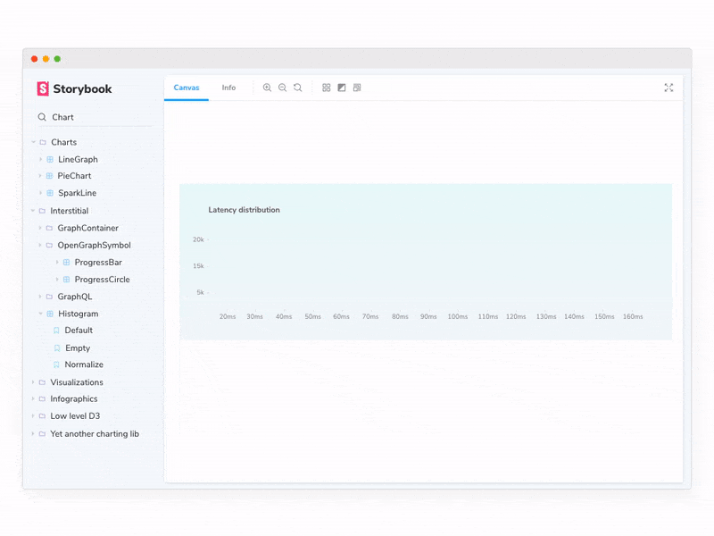

# How to add Storybook to a Typescript CRA project

__[Storybook](https://storybook.js.org/) is a development environment for React UI components. It allows you to browse a component library, view the different states of each component, and interactively develop and test components.__

<div style="text-align:center;max-width:100%;"></div>

This tutorial is about setting up storybook for a React Project with Typescript created by using [Create React App (CRA)](https://create-react-app.dev/docs/adding-typescript/) command.

## Steps

### Step 1- Install storybook CLI

The first thing you'll have to do is install the [Storybook CLI]((https://www.npmjs.com/package/@storybook/cli)) (Command Line Interface) - this is the easiest way to add Storybook to your CRA project.

```
yarn add @storybook/cli
```

### Step 2 - Setting up storybook in your project

After installing the CLI, you'll need to [set up the storybook](https://create-react-app.dev/docs/developing-components-in-isolation/#getting-started-with-storybook) by running the following command:

```
npx -p @storybook/cli sb init
```

### Step 3 - Update settings to handle typescript files

We're almost done! Go to `.storybook/main.js` and confirm if the stories property is prepared to handle`.tsx` files instead of `.js`:

```
stories: ['../src/**/*.stories.tsx']
```


### Step 4 - Run the storybook

If you go to the `package.json` file you'll realize some new commands there:

```
"storybook": "start-storybook -p 9009 -s public",
"build-storybook": "build-storybook -s public"
```

You can check if storybook is working by running the following command:

```
yarn storybook
```

## Aditional settings

- __When using [react-router-dom](https://www.npmjs.com/package/react-router-dom)__ in some component that contains a story you need to set a configuration to storybook handle it. You can do it by using the [storybook-router dependency](https://www.npmjs.com/package/storybook-react-router).

-__When using [Material UI](https://material-ui.com/)__ [this is a great tutorial](https://medium.com/encode/setting-up-storybook-with-material-ui-and-styled-components-5bdacb6db866) to add the correct settings.


