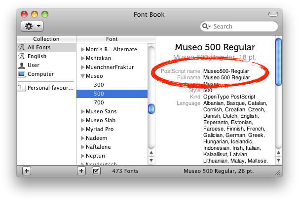

# Using custom fonts in React Native app

__The solution to add custom fonts in react native project is actually pretty simple with react-native link command but can be tricky sometimes.__

## Custom Font Naming

It's import to notice that Android and iOS differs when it comes to referencing your fonts. 

On Android, you can reference the font by its file name (case sensitive), while on iOS you should reference it by its name as described in its meta description (postscript name).

We can check the “postscript name” of a font file in Font book and keep the name of the font the same as it:

<div style="text-align:center"></div>

Let's take a look at the steps.

---

## Steps to add a custom font in React Native project

### Step 1: Add Fonts to Assets

Add all the font files you want to an “assets/fonts” folder in the root of your react native project.

### Step 2: Adding the `react-native.config.js` file

Create a file in the root folder of your project called `react-native.config.js`, and add the following:

```
module.exports = {
    assets: ['./assets/fonts/']
};
```

### Step 3: Link assets using react native link

Run the following command in your terminal:

```
react-native link
```

Link command will links fonts in Info.plst for IOS and creates fonts directory (android/app/src/main/assets/fonts) for Android, where copies your fonts.

### Step 4: Use font in React Native Styles

Finally you can use font in styles:

```
fontFamily: "Museo500-Regular"
```

or, if you are using Styled Components:

```
font-family: "Museo500-Regular"
```


